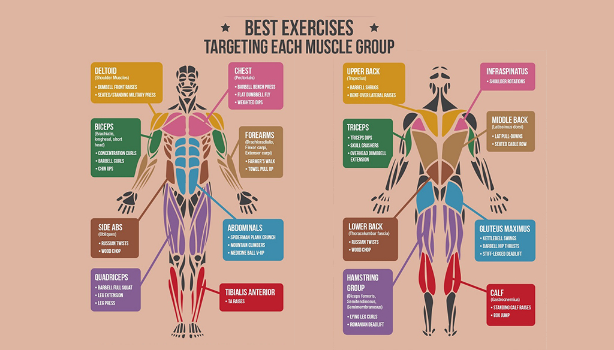
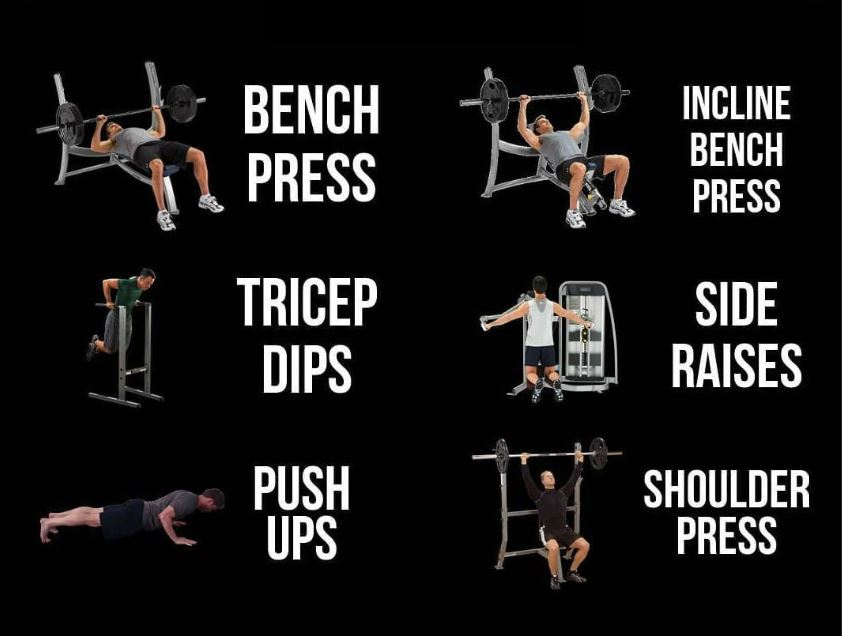
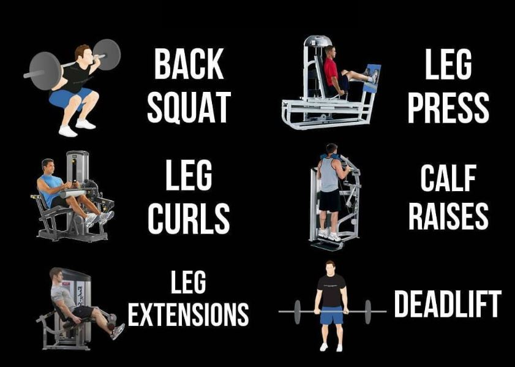
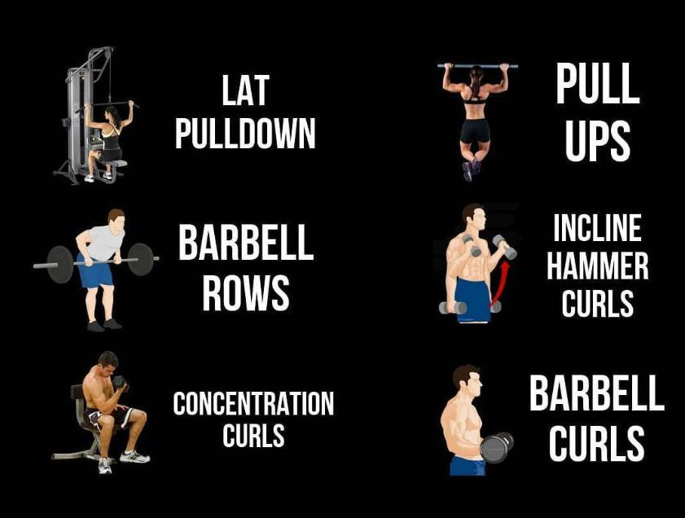

## PUSH-PULL WORKOUT 
Exercises in which your elbow joints are straight at contractions (bench presses, shoulder presses, pushdowns, etc.) are pushers. Exercises in which your elbow joints are bent at contractions (rows, pulldowns, barbell curls, etc.) or in which you lift vertically (deadlifts, shrugs, etc.) are pullers. Pushers and pullers are divided into separate workouts. So, in a push-pull routine, you work chest, front and side delts, and triceps in a push workout, and back, rear delts, traps, and biceps in a pull workout. This allows you to train bodyparts twice weekly or twice every eight days with sufficient time to recuperate between workouts. 

> reference: [The Barbell](https://www.thebarbell.com/the-push-pull-workout-system/)

### Basics
- body is divided into three workouts over three days.
- A push-pull split can be done on any schedule. For example, you can train three days per week: Monday (pull), Wednesday (push), Friday (legs).
- push-pull workout should progress like this: chest or back first, shoulder muscle(s) next, arm muscles last.
- pushing muscles (chest, front and side delts, triceps) for one workout
- pulling muscles (back, rear delts, traps, biceps) for a different workout.
- schedule leg day between the push and pull days. Legs can also be divided into push (quads) and pull (hamstrings) workouts.
- Calves and abs can be trained in any workout.

## PUSH-PULL WORKOUT SPLIT: 3-ON, 1-OFF

### Day 1  
#### [PUSH: Chest, front and side delts, triceps](./01_push/push.md)

> Additional: Dips, Push ups, Skullcrusher, Egyptian lateral raise, Cable triceps kickback, 

| Muscle                                                      | Plan (reps)                                                                                                                                       |
| ----------------------------------------------------------- | :------------------------------------------------------------------------------------------------------------------------------------------------ |
| a. [Chest](./01_push/push.md#chest)                         | Barbell Bench Press (4 x 12-8)   Dumbbell Incline Press (4 x 12-8)   Cable Crossover (4 x 10-12)   Dip (3 x 10-12)                 |
| b. [Front/Side Delts](./01_push/push.md#front--side-delts)  | Barbell/Machine Shoulder Press (4 x 12-8)   Dumbbell Front Raise (3 x 10-12)   Side Lateral (5 x 10-15)                                 |
| c. [Triceps](./01_push/push.md#triceps)                     | Lying Triceps Extension (4 x 10-12)   Dumbbell/Overhead Triceps Extension (3 x 10-12)   Pushdown (4 x 10-12)                            |
| d. [Shoulders/Pecks](./01_push/push.md#triceps)             | Shoulder Overhead Press (4 x 10-12)   Close Grip Bench Press (3 x 10-12)   Dumbbell Lateral Raise  (3 x 10-12)   Neck Extension    |

    
### Day 2   
#### [LEGS: Quads, hamstrings, calves, abs](./02_legs/legs.md)

> Additional: weighted L sithold

| Muscle                                                      | Plan (reps)                                                                                                                                       |
| ----------------------------------------------------------- | :------------------------------------------------------------------------------------------------------------------------------------------------ |
| a. [Quads](./02_legs/legs.md#squat---barbell)               | Squat - Barbell (4 x 10-12)   Romanian Deadlift (4 x 10-12)   Leg Press - Seated (4 x 10-12)    Leg Extensions - Seated            |
| b. [Calves](./02_legs/legs.md#calf-raise---seated)          | Leg Curls - Seated    Calf raise - Seated                                                                                                    |
| b. [Glutes/Hamstring](./02_legs/legs.md)                    | Deadlift (3 x 3)   Hack/Barbel/Goblet Squat (4 x 10)    Unilateral Hip thrust    Prisoner back extensions (4 x 10)                 |
| d. [Abs](./02_legs/legs.md#abs-crunch)                      | Decline Crunch (4 x 10-12)    Long lever planks (2 x 30s)                                                                                    |

### Day 3   
#### [PULL: Back, rear delts, traps, biceps, forearms](./03_pull/pull.md)

> Additional: Pullup, Kneeling cable pullover, Hammer Curls, Chest Supported Row machine, Rope face pulls

| Muscle                                                      | Plan (reps)                                                                                                                                       |
| ----------------------------------------------------------- | :------------------------------------------------------------------------------------------------------------------------------------------------ |
| a. [Back](./03_pull/pull.md#back)                           | Front Pulldown (4 x 10-12)   Barbell Row (4 x 12-8)   One-arm Dumbbell Row (4 x 10-12)   Seated Low-cable Row 3 x 10-15            |
| b. [Rear Delts](./03_pull/pull.md#rear-delts)               | Machine Rear Lateral (4 x 10-15)                                                                                                                  |
| c. [Trapezius](./03_pull/pull.md#trapezius)                 | Dumbbell Shrug (4 x 10-12)                                                                                                                        |
| d. [Biceps](./03_pull/pull.md#biceps)                       | EZ-bar Pronated/Supinated Curl (4 x 10-12)   Machine Curl (4 x 10-12)   Incline Dumbbell Curl (3 x 10-12)                               |
| e. [Forearms](./03_pull/pull.md#forearms)                   | Wrist Curl (4 x 12-15)                                                                                                                            |
    

### Day 4   OFF
